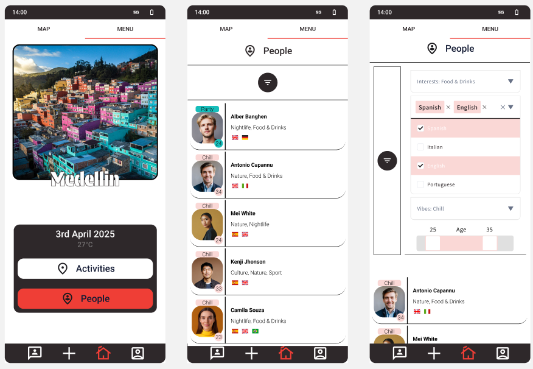
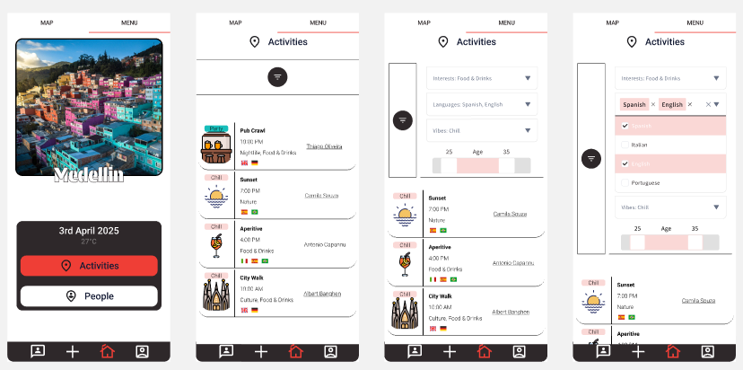
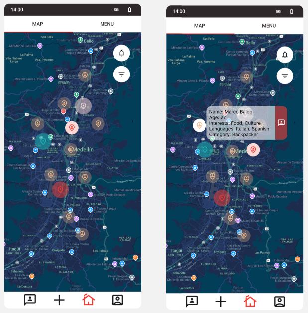

```markdown
# Roamly

Roamly is a mobile app designed for students, travelers, and digital nomads who want to build connections based on shared interests.  
The goal is to create an environment where meeting new people, joining local events, and exploring dynamic communities becomes easy and natural.

---

## 🔍 Why Roamly
- Encourages authentic socialization through shared interests.  
- Ideal for students abroad, frequent travelers, or anyone living in a new place.  
- Lets you discover events and get to know participants beforehand.  

---

## 📱 Design & UX
- The interface was designed in Figma, focusing on clarity, simplicity, and effectiveness.  
- UX/UI was built to be intuitive, with minimalist flows and essential information always accessible.  
- The app makes heavy use of Mapbox, enabling an interactive map with custom markers for both people and events.  
- This is a Work In Progress (WIP) project developed as part of the Mobile Application Development course exam.  

### Screens

#### People & Activities
  


#### Map & Interactive Markers


(Design prototype built with Figma)

---

## 🛠️ Tech Stack
- Frontend: Android (Kotlin)  
- Backend: [Supabase](https://supabase.com/) (Auth, Database, Storage)  
- Key Libraries:  
  - Mapbox (interactive maps and markers)  
  - Material Design Components  
  - Coroutine + Flow for async management  

---

## ⚙️ Project Status
- 🏗️ Work In Progress: functional prototype with solid foundations.  
- Developed independently as a university exam project.  
- Future improvements planned: more social features, UI/UX enhancements, localization, and bug fixes.  

---

## 📂 Repository Structure
```

/app          → Android source code (UI, logic, models)
/gradle       → build scripts
build.gradle, settings.gradle → project configuration
.gitignore    → ignored files for Git

```
```
